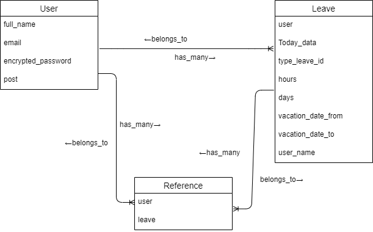
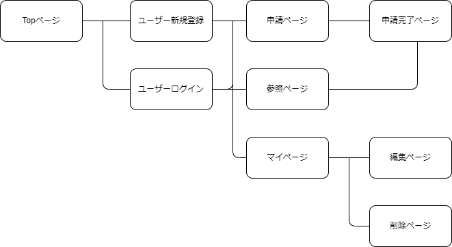

# アプリケーション名
No paper

# アプリケーション概要
紙による申請書類での問題があり、もしアプリケーションによるシステム管理がされていればという考えから作成に至りました。現在はまだ草案の段階ですが、休暇申請や参照などの機能とユーザーごとに確認できる機能を考えております。

# URL

# テスト用アカウント

# 利用方法

## ユーザーごとに申請ができる

## 参照ページから申請された書類の一覧が見れる

# アプリケーションを作成した背景
職場での申請書類等は厄介で、特に申請した本人は問題なく確認しているというのに記述ミスは発生する。管理者側としてもこの記述ミスにより作業がストップすることも間々ある。もしこれが簡単に本人も管理者も確認できるアプリケーションであればという考えから作成に至りました。

# 洗い出した要件

# 実装した機能についての画像やGIFおよびその説明

# 実装予定の機能

# データベース設計

# 画面遷移図

# 開発環境
・フロントエンド

・バックエンド

・テキストエディタ

・テスト

・タスク管理

# ローカルでの動作確認
以下のコマンドを順に実行

# 工夫したポイント

